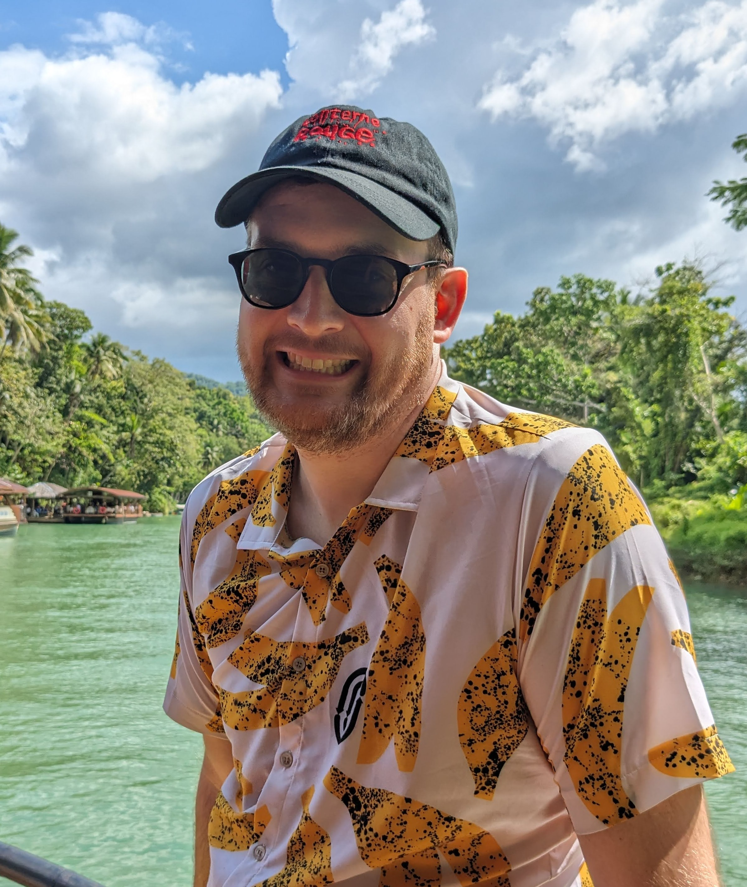

## Matt Paul

**Background**  
Matt studied his BSc Genetics at University of Manchester which included a year working as a predoctoral fellow at Thomas Jefferson University in Philadelphia. Subsequently he completed his PhD in Biology at New York University with a focus on epigenetics and genome organization.

Upon completion of my PhD in 2019, Matt joined Rockefeller University as part of the Bioinformatics Resource Center.

Matt is particuarly interested in analysis reproducibility, and is the lead developer of the Herper package for utilizing the Conda ecosystem within R.  

**Team Roles**: Matt works as a Bioinformatics Analyst and leads the BRC bioinformatics training program.

<!--
## Thomas Carroll

**Background**  
Tom studied his BSc in Genetics and Biochemistry from the University of Wales, Swansea, and was awarded the Roger Gilbert prize in Quantitative Genetics.
For his postgraduate studies, Tom received for his MRes with Distinction in Bioinformatics at the University of Exeter and his PhD in Toxicogenomics from Kings College London.
Following this, Tom undertook a MRC career development fellowship at the MRC Clinical Sciences Center before joining the CRUK Cambridge Institute as Senior Bioinformatician in the Bioinformatics Core.
Tom then returned to London to form and head the Bioinformatics Core at the MRC LMS in Imperial College London. In 2017, Tom joined the Rockefeller University to establish and direct the Bioinformatics Resource Cneter here.

Tom is a keen advocate for open source science, releasing several R packages, creating and hosting bioinformatics training and developing highly literate and transparent bioinformatics pipelines for the processing and primary analysis of high throughput sequencing data. 

**Team Roles**: Tom is the Director of the Bioinformatics Resource Center at the Rockefeller Univeristy and in this role

Here are some ideas to get you started:

- 🔭 I’m currently working on ...
- 🌱 I’m currently learning ...
- 👯 I’m looking to collaborate on ...
- 🤔 I’m looking for help with ...
- 💬 Ask me about ...
- 📫 How to reach me: ...
- 😄 Pronouns: ...
- ⚡ Fun fact: ...
-->
